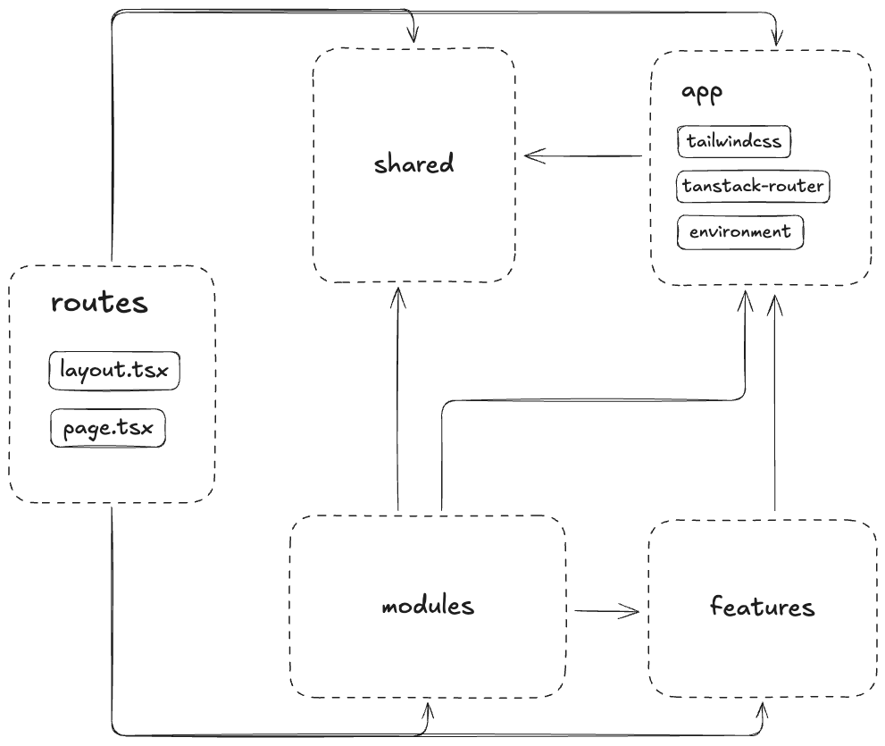

# 📂 Project Structure Documentation

This document outlines the architectural organization of the codebase, which is based on a **scope-based structure** to ensure **separation of concerns**, predictable **dependency flow**, and ease of maintenance.

Most of the application logic resides within the `src/` directory.

## 🗂️ Core Directory Scopes

The `src/` directory is organized into the following top-level scopes:

```plain
src/
├── routes/                       # File-based routing (pages, layouts, and redirects).
├── app/                          # Global application configuration and setup.
├── modules/                      # Large, self-contained application sections/domains.
├── features/                     # Reusable business-specific functionality.
├── shared/                       # Generic, reusable code with no business logic.
└── main.tsx                      # Application entry point.
```

## 🗺️ Scope Definitions and Responsibility

The codebase is organized into four primary categories — **Routing**, **Global/Infrastructure**, and **Business Logic** — each with specific responsibilities and clear dependency rules.

### 🧭 Routes

| Scope     | Description                                                                                                                                                                                                   |
|-----------|---------------------------------------------------------------------------------------------------------------------------------------------------------------------------------------------------------------|
| `routes/` | Contains all files related to file-based routing. This includes route components, layouts, error boundaries, and redirects. This scope directly defines the navigation and page structure of the application. |

### ⚙️ Global & Infrastructure Scopes

| Scope     | Description                                                                                                                                            | Details                                                                                                                             |
|-----------|---------------------------------------------------------------------------------------------------------------------------------------------------------|------------------------------------------------------------------------------------------------------------------------------------|
| `app/`    | **Global Application Setup**. Code for global configuration, application environment, and styling that is required by the entire application.         | Examples: `environment/` (env variables, runtime config), `tailwindcss/` (config, global styles), `tanstack-router/` (router setup). |
| `shared/` | **Generic Utilities and Reusable**. Contains generic, reusable utilities, base components, hooks, and types that have **no business-specific logic**. | Examples: UI components (buttons, modals), generic API utilities, common types.                                                      |

### 💼 Business Logic Scopes

These scopes contain the core logic and features that deliver specific user value. They enforce a hierarchy of complexity and reusability.

| Scope       | Description                                                                                                                                                                                  | Reusability                                                                            |
|-------------|----------------------------------------------------------------------------------------------------------------------------------------------------------------------------------------------|----------------------------------------------------------------------------------------|
| `modules/`  | **Large Application Domains**. Represents large, self-contained sections of the application, often corresponding to distinct use cases or major domains (e.g., `user-management`, `cart`).   | **Low**. Designed for specific, large parts of the application.                        |
| `features/` | **Reusable Business Features**. Contains smaller, reusable features that deliver a specific user value or service (e.g., `login`, `add-user`, `search`).                                     | **High**. Designed to be composed and reused across different `modules/` or `routes/`. |

## 🔗 Dependency Rules

The scope-based structure strictly defines how components can interact, establishing a **clear one-way dependency flow**.

| Scope       | Can Depend On                              | Cannot Depend On                                              |
|-------------|--------------------------------------------|---------------------------------------------------------------|
| `routes/`   | `app/`, `shared/`, `modules/`, `features/` |                                                               |
| `modules/`  | `app/`, `shared/`                          | `features/` (Must be self-contained)                          |
| `features/` | `app/`, `shared/`                          | `modules/`, other `features/` (Must be atomic and composable) |
| `shared/`   | (None)                                     | (All other scopes - Must be generic)                          |
| `app/`      | `shared/`                                  | `routes/`, `modules/`, `features/`                            |


